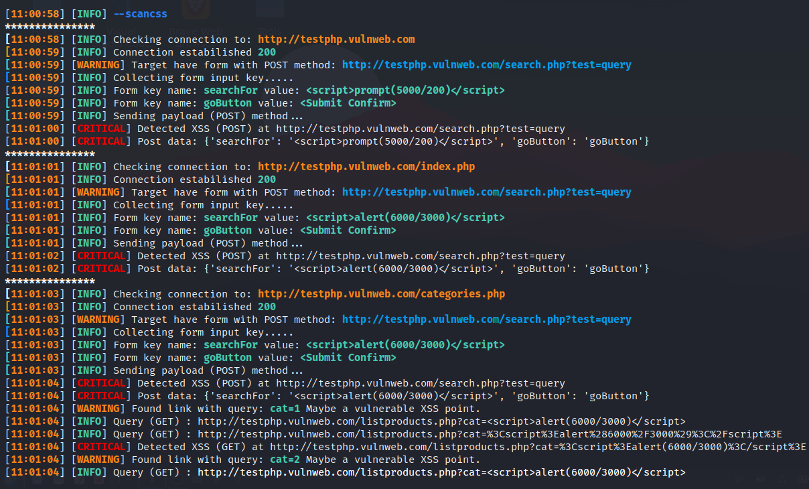
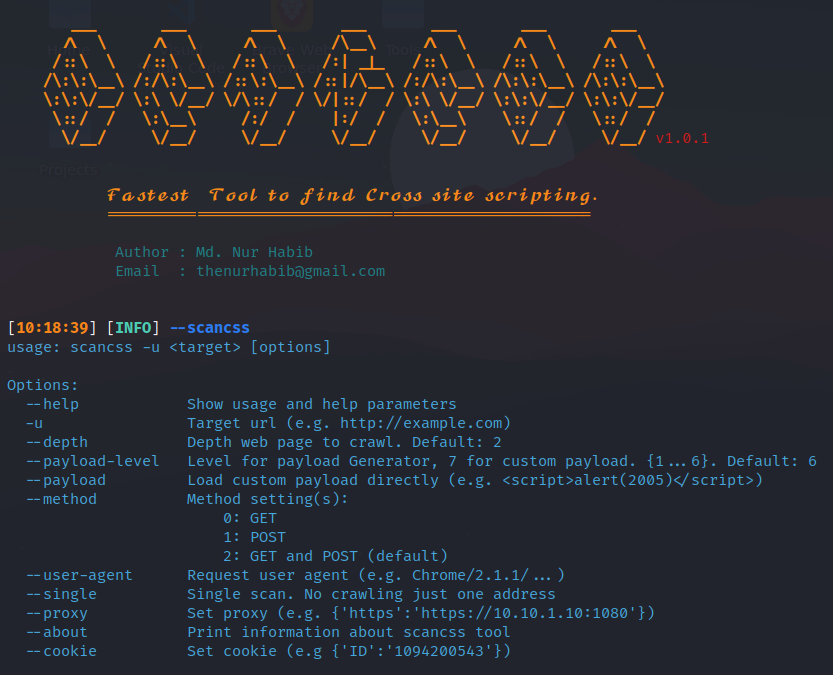
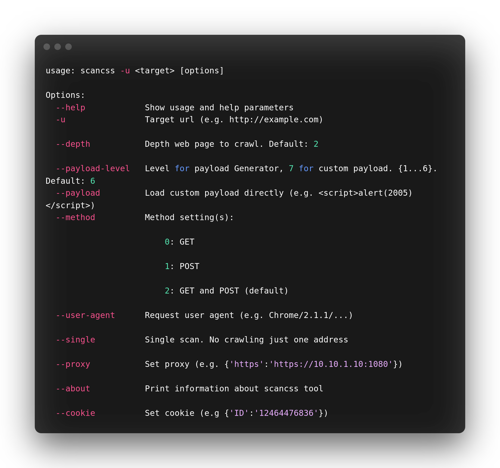

<h1 align="center">
  <br>
  <a  href="https://github.com/thenurhabib/scancss"></a>
  <br>
  scancss
  <br>
</h1>

<h4 align="center">Fastest tool to find XSS.</h4>

<p align="center">
  <a href="https://github.com/thenurhabib/scancss/releases">
    
  </a>
  <a href="https://travis-ci.com/thenurhabib/scancss">
    
  </a>
  
</p>



<hr>

### scancss is a fastest tool to detect Cross Site automatically and it's also an intelligent payload generator.

<br>

### Main Features
- Reflected XSS scanning
- Blind xss find
- Crawling all links on a website
- POST and GET forms are supported
- Advanced error handling
- Multiprocessing support

<br>



<br>


### Documentation
### install
```yaml
git clone https://github.com/thenurhabib/scancss.git
cd scancss
python -m pip install -r requirements.txt
chmod +x install.sh uninstall.sh 
sudo ./install.sh
```

<br>

### Uninstall
```yaml
sudo ./uninstall.sh
```

#### Usage

```yaml
======================================================================== 
usage: scancss -u <target> [options]

Options:
  --help            Show usage and help parameters
  -u                Target url (e.g. http://example.com)                                                      
  --depth           Depth web page to crawl. Default: 2                                                       
  --payload-level   Level for payload Generator, 7 for custom payload. {1...6}. Default: 6                    
  --payload         Load custom payload directly (e.g. <script>alert(2005)</script>)                          
  --method          Method setting(s):                                                                        
                        0: GET                                                                                
                        1: POST                                                                               
                        2: GET and POST (default)                                                             
  --user-agent      Request user agent (e.g. Chrome/2.1.1/...)                                                
  --single          Single scan. No crawling just one address                                                 
  --proxy           Set proxy (e.g. {'https':'https://10.10.1.10:1080'})                                      
  --about           Print information about scancss tool                                                      
  --cookie          Set cookie (e.g {'ID':'12464476836'})                                                      
                                                                                                              
========================================================================                                                                                               
```
<br>



### Author
```yaml
Name       : Md. Nur habib
Medium     : thenurhabib.medium.com
Twitter    : https://twitter.com/thenurhab1b
HackerRank : https://www.hackerrank.com/thenurhabib

```

##### Thank You.
